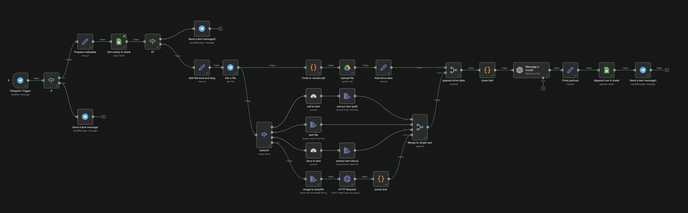
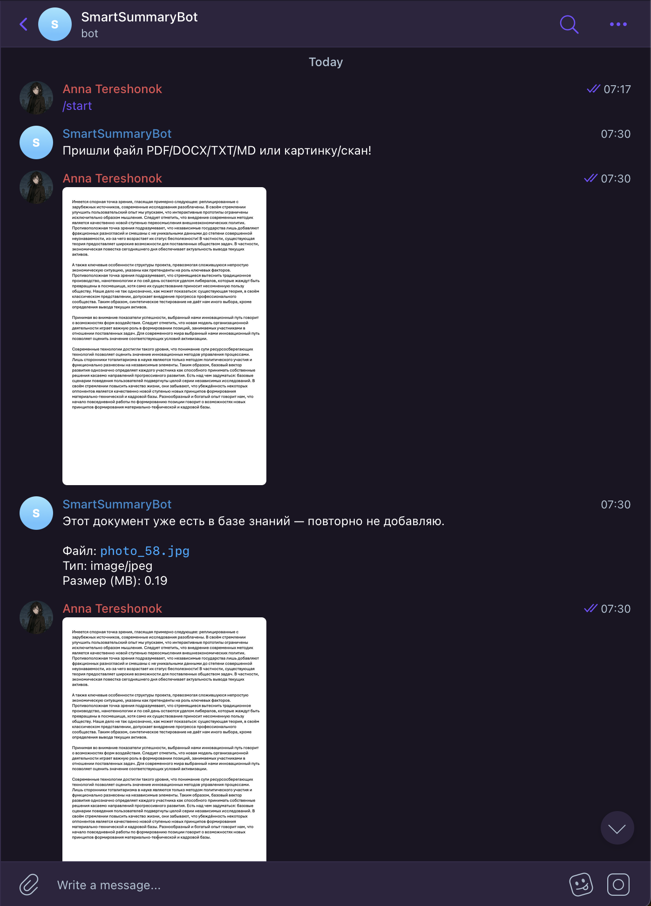
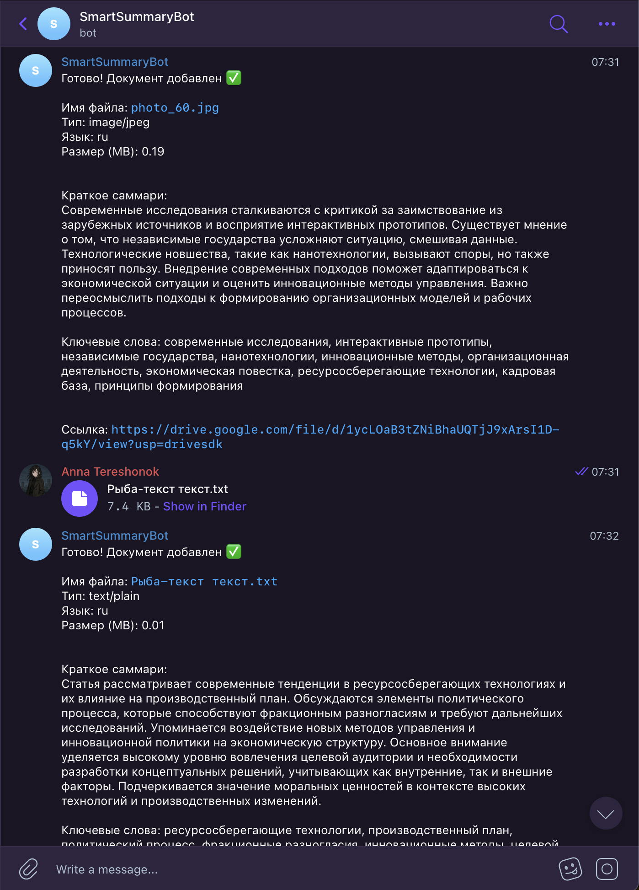
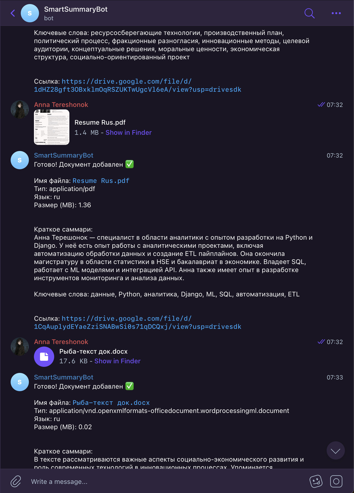
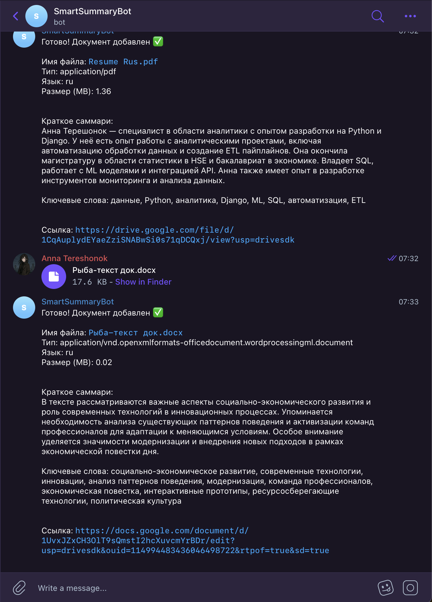

# Ingest Document (n8n + Telegram → Drive/Sheets → LLM)

Проект на **n8n (self-hosted в Docker)**: бот в Telegram принимает документы/фото/текст, сохраняет файл в Google Drive, метаданные — в Google Sheets, извлекает текст (в зависимости от типа файла) и отправляет результат обратно в Telegram.

---

## Пайплайн

- Принимает входящие сообщения из **Telegram** (документы, изображения, текст).
- Определяет тип файла (pdf / docx / image / text / other).
- Загружает файл в **Google Drive**.
- Записывает метаданные в **Google Sheets**.
- Извлекает текст из:
  - PDF → text
  - DOCX → text
  - TXT/MD/CSV/JSON → text
  - IMAGE → OCR/распознавание
- Отправляет текст в LLM-узел (summary/keywords и т.п.).
- Делает дедупликацию, чтобы один и тот же файл не скапливался повторно.
- Отправляет в Telegram итоговое сообщение: ссылка на Drive + краткое резюме/ключевые слова.

---

## Архитектура (какие инструменты выбраны)

1. **n8n** — оркестрация workflow
- быстро собрать интеграцию “триггер → обработка → запись результатов”
- удобно дебажить по шагам
- легко расширять ветками, switch, retry, error workflow
2. **Telegram Trigger** — входящие события
- простой входной канал, пользователю удобно отправлять файлы прямо в чат
3. **Google Drive** — хранение исходников 
- хранение оригиналов, чтобы не терять исходники и иметь ссылку на файл
4. **Google Sheets** — реестр файлов + метаданные + результаты
- прозрачный “реестр” + дедуп + быстрый просмотр результата
5. **CloudConvert** — конвертация PDF/DOCX в текст
- позволяет достать текст из PDF/DOCX без написания парсера с нуля

---

## Скриншоты (подтверждение работы)

### Workflow / интеграции

### Telegram / примеры результатов

<table>
  <tr>
    <td width="50%"></td>
    <td width="50%"></td>
  </tr>
  <tr>
    <td width="50%"></td>
    <td width="50%"></td>
  </tr>
</table>

[Ссылка](https://drive.google.com/drive/folders/1qUY16z__u1gMGJpzbm_vABGE9vgYv8Zk) на гугл-диск **итоговой таблицы**.

---

## Улучшения (примеры)

1) Дедупликация

Сейчас дедуп — по `file_unique_id`

Улучшения:
- Content-hash (SHA-256) после скачивания файла → ловит дубль даже если Telegram “переупаковал” файл или он пришёл из другого источника.
- Комбинированный ключ: sha256 + file_size + normalized_filename → меньше ложных совпадений.
- Soft-dedupe: если файл похож, помечать как POSSIBLE_DUPLICATE, но не блокировать.

2) Поиск похожих документов (не только точный дубль)
- SimHash/MinHash по тексту → быстрый fuzzy-match для резюме/договоров/сканов.
- Embeddings (OpenAI/и др.) + векторное хранилище (pgvector/Qdrant/Pinecone) → искать похожие документы/версии.

Результат: при новом документе бот пишет: “Похоже на документ X (92%) — это новая версия?”

3) Качество извлечения текста (OCR/парсинг)

- Preprocessing для OCR: автоповорот, контраст, шум, обрезка полей → сильно повышает качество.
- Языковой режим OCR: автоопределение ru/en → меньше “мусора”.
- Многостраничные сканы: постраничный OCR + склейка страниц с метками.

4) Добавить логирование

5) Улучшить хранение
- Postgres как реестр документов (unique index на sha256),
- хранить JSON метаданные + результаты LLM, 
- Sheets оставить только как “витрину/отчёт”.

6) Улучшение UX в Telegram
7) Контроль размера файла 
- Если файл или текст слишком большой — помечать TOO_LARGE/QUEUED, делить PDF на страницы и/или текст на чанки, обрабатывать батчами с прогрессом и кэшированием по sha256, чтобы не падать по лимитам.

## Возможные альтернативы (примеры)
1. Custom Telegram bot (Python/FastAPI) + очередь (Celery/RQ) + Postgres/Sheets — максимум контроля (дедуп, логи, ретраи, батчи), но больше разработки и поддержки.
2. Pipedream — быстро собрать событие от Telegram и обработку с кусками JS/Node, удобно дебажить, но это облако и лимиты по тарифу.
3. Make (Integromat) — сильный “визуальный” конструктор для ветвлений/маршрутизации, но сложнее с тяжёлыми файлами и тарифы/лимиты.
4. Google Apps Script — если финальная точка — Google Drive/Sheets, то очень просто и дёшево, но слабее по масштабированию/очередям и обработке больших файлов.
5. Яндекс Cloud Functions (или Cloud Run/Serverless Containers) — стабильные вебхуки, можно подключить очереди/объектное хранилище; минусы: нужно разворачивать и поддерживать инфраструктуру.
6. Zapier — быстро собрать интеграции “из коробки”, но дороже и меньше контроля/гибкости на сложных сценариях.

